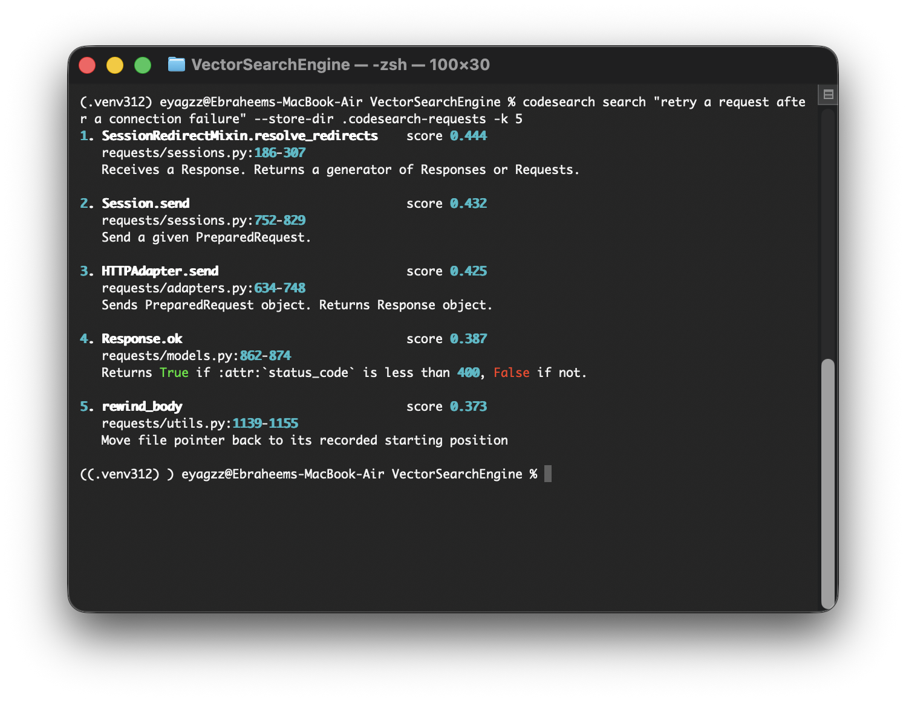
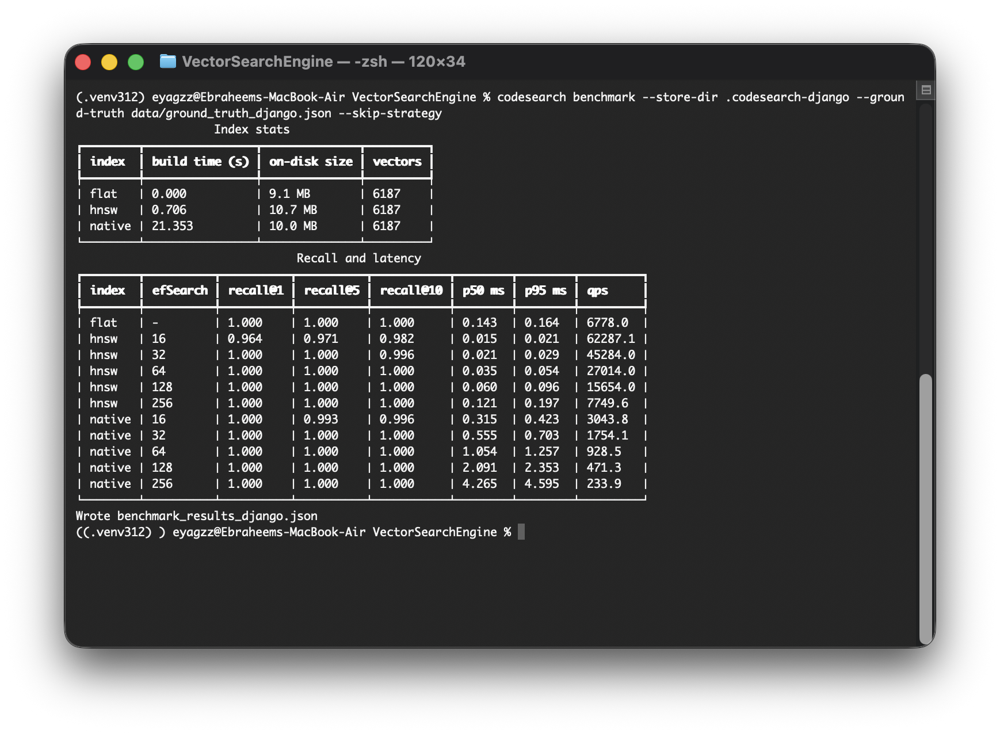

# codesearch

Grep matches names. This CLI matches behavior: it indexes Python functions as vectors and ranks them by a natural-language description of what they do.

The point of the project is not “search that looks plausible.” It is a measured accuracy/latency tradeoff between exact (flat) search and HNSW.

## Install

Python 3.11+. No API keys. The embedding model downloads once, then everything is local.

```bash
python3.12 -m venv .venv
source .venv/bin/activate
pip install -e ".[dev]"
```

The CLI exits if it is launched with an older interpreter. Python 3.9 skipped four Django production files and produced a different corpus.

```bash
pytest
```

44 tests (43 pass on 3.12; one skip is the Python 3.11+ CLI guard). No CI yet; tests run locally with pytest.

## Quickstart

```bash
git clone --depth 1 https://github.com/psf/requests.git /tmp/requests-corpus
codesearch index /tmp/requests-corpus/src --store-dir .codesearch-requests
codesearch search "retry a request after a connection failure" --store-dir .codesearch-requests
codesearch benchmark --store-dir .codesearch-requests --ground-truth data/ground_truth.json --output benchmark_results_requests.json
```

Django and the 52k mixed corpus use their own stores, labels, and result files. Do not point a Django index at `data/ground_truth.json`.



Label provenance is in `data/GROUND_TRUTH.md`.

## What was indexed

Measured 2026-09-05 on this machine (macOS arm64, 8 cores, FAISS pinned to 1 thread). Model `all-MiniLM-L6-v2` revision `1110a243fdf4706b3f48f1d95db1a4f5529b4d41`. Python 3.12.14, faiss-cpu 1.15.0, sentence-transformers 6.0.1, torch 2.14.0.

| corpus | functions | labels | result file |
| --- | --- | --- | --- |
| `psf/requests` `src/` (`dae7ef63`) | 151 | `data/ground_truth.json` (30) | `benchmark_results_requests.json` |
| `django/django` `django/` (`b3f4d83a`) | 6187 | `data/ground_truth_django.json` (28) | `benchmark_results_django.json` |
| mixed 11-repo tree (below) | 52800 | remapped Requests+Django (58) | `benchmark_results_scale.json` |

The mixed tree is one `codesearch index` root at `/tmp/scale-src`:

| tree | git | functions |
| --- | --- | --- |
| CPython | `7a918411a300` | 15328 |
| SQLAlchemy | `de83fa72d787` | 6300 |
| Django | `b3f4d83aad7f` | 6187 |
| pandas | `70e6c48ff317` | 5892 |
| Ansible | `3827d66bfbdc` | 5043 |
| matplotlib | `f3877c54e25b` | 4633 |
| scikit-learn | `9bafc1c9cab9` | 3890 |
| Sphinx | `e44a40eb2f81` | 2896 |
| NumPy | `22c80bc405bc` | 2214 |
| Flask | `d318b6834711` | 266 |
| Requests | `dae7ef63b4df` | 151 |

CPython main uses syntax newer than 3.12; those files warned and were skipped. That shrinks the stdlib slice but does not invent vectors.

## The finding: the tradeoff appears at 50k, not at 6k

Recall@k is ANN vs the flat index (flat is the referee). Each query ran 5 warmup + 20 timed iterations. p50 and p95 are over all timed samples. `hnsw` is FAISS. `native` is this repo’s HNSW, same M=32 and efConstruction=200.

| corpus | n | flat p50 | FAISS ef16 | native ef16 | FAISS speedup | native vs FAISS |
| --- | --- | --- | --- | --- | --- | --- |
| Requests | 151 | 0.009 ms | 0.009 ms (0.983) | 0.242 ms (1.000) | 1.0× | 28× slower |
| Django | 6187 | 0.143 ms | 0.015 ms (0.982) | 0.315 ms (0.996) | 9.6× | 21× slower |
| mixed | 52800 | 1.340 ms | 0.021 ms (0.955) | 0.332 ms (0.974) | 64× | 16× slower |

At 151 vectors FAISS is not faster than a scan. At 6,187 it is 9.6× faster and saves 0.128 ms — a demo, not a decision. At 52,800 it is 64× faster and saves 1.32 ms. That is the scale where approximate search is a choice.

Native HNSW matches FAISS recall (slightly higher on Django and the mixed corpus) and loses badly on speed. On 52,800 vectors it is still 4× faster than flat, so the algorithm is doing real ANN work; FAISS wins on SIMD and memory layout, not on a different graph.

HNSW’s tail is worse than flat’s. On the mixed corpus, flat p95/p50 is 1.4× (1.837 / 1.340). FAISS at `efSearch=16` is 1.8× (0.037 / 0.021). Native is 1.4× (0.475 / 0.332) but from a much higher base.

### Mixed corpus (52800 vectors)

From `benchmark_results_scale.json` `results`. On-disk: flat 77.3 MB, FAISS 91.1 MB, native 85.7 MB. Build: FAISS 23.6 s, native 218 s.

| index | efSearch | recall@10 | p50 (ms) | p95 (ms) | vs flat |
| --- | --- | --- | --- | --- | --- |
| flat | — | 1.000 | 1.340 | 1.837 | 1.0× |
| hnsw (FAISS) | 16 | 0.955 | 0.021 | 0.037 | 64× |
| hnsw (FAISS) | 32 | 0.991 | 0.029 | 0.058 | 46× |
| hnsw (FAISS) | 64 | 1.000 | 0.046 | 0.094 | 29× |
| hnsw (FAISS) | 128 | 1.000 | 0.084 | 0.190 | 16× |
| hnsw (FAISS) | 256 | 1.000 | 0.170 | 0.435 | 7.9× |
| native | 16 | 0.974 | 0.332 | 0.475 | 4.0× |
| native | 32 | 0.986 | 0.584 | 0.805 | 2.3× |
| native | 64 | 0.998 | 1.103 | 1.382 | 1.2× |
| native | 128 | 0.998 | 2.295 | 2.826 | 0.6× |
| native | 256 | 1.000 | 4.902 | 6.564 | 0.3× |

Headline: **FAISS at `efSearch=16` was 64× faster than exact search at 95.5% recall@10.** Native at the same setting was 4× faster than exact at 97.4% recall, and **16× slower than FAISS**.

`efSearch` 64+ on FAISS reported recall@10 = 1.0 while staying far faster than flat, so that is not a silent exact scan. The misses live at 16 and 32.

### Django (6187 vectors)



From `benchmark_results_django.json` `results`. Native build 21.4 s vs FAISS 0.71 s.

| index | efSearch | recall@10 | p50 (ms) | p95 (ms) | vs flat |
| --- | --- | --- | --- | --- | --- |
| flat | — | 1.000 | 0.143 | 0.164 | 1.0× |
| hnsw (FAISS) | 16 | 0.982 | 0.015 | 0.021 | 9.6× |
| hnsw (FAISS) | 32 | 0.996 | 0.021 | 0.029 | 6.7× |
| hnsw (FAISS) | 64 | 1.000 | 0.035 | 0.054 | 4.1× |
| hnsw (FAISS) | 128 | 1.000 | 0.060 | 0.096 | 2.4× |
| hnsw (FAISS) | 256 | 1.000 | 0.121 | 0.197 | 1.2× |
| native | 16 | 0.996 | 0.315 | 0.423 | 0.45× |
| native | 32 | 1.000 | 0.555 | 0.703 | 0.26× |
| native | 64 | 1.000 | 1.054 | 1.257 | 0.14× |
| native | 128 | 1.000 | 2.091 | 2.353 | 0.07× |
| native | 256 | 1.000 | 4.265 | 4.595 | 0.03× |

At 6k, native HNSW is slower than brute force. FAISS is not. That is the implementation gap.

### Requests (151 vectors)

From `benchmark_results_requests.json` `results`. Native build 0.15 s vs FAISS 0.003 s.

| index | efSearch | recall@10 | p50 (ms) | p95 (ms) | vs flat |
| --- | --- | --- | --- | --- | --- |
| flat | — | 1.000 | 0.009 | 0.010 | 1.0× |
| hnsw (FAISS) | 16 | 0.983 | 0.009 | 0.010 | 1.0× |
| hnsw (FAISS) | 32 | 0.997 | 0.010 | 0.012 | 0.8× |
| hnsw (FAISS) | 64 | 1.000 | 0.013 | 0.019 | 0.6× |
| hnsw (FAISS) | 128 | 1.000 | 0.021 | 0.032 | 0.4× |
| hnsw (FAISS) | 256 | 1.000 | 0.024 | 0.039 | 0.4× |
| native | 16 | 1.000 | 0.242 | 0.355 | 0.04× |
| native | 32 | 1.000 | 0.450 | 0.532 | 0.02× |
| native | 64 | 1.000 | 0.888 | 1.021 | 0.01× |
| native | 128 | 1.000 | 1.728 | 1.897 | 0.005× |
| native | 256 | 1.000 | 2.009 | 2.175 | 0.004× |

Graph walk overhead dominates when the corpus fits in one brute-force scan. Native is 28× slower than FAISS here and never beats flat.

`benchmark_results.json` is a pointer, not a measured run.

## Labeled search quality

Flat hit@10 against the hand-written labels:

| corpus | hit@10 |
| --- | --- |
| Requests | 29/30 |
| Django | 20/28 |
| mixed (same 58 labels, more distractors) | 40/58 |

The isolated sets score 49/58 together. Nine of those hits disappear in the mixed tree. Eight are Requests queries that now lose to the same idea in urllib, Ansible, Sphinx, or matplotlib (`HTTPAdapter.send` → `UnixHTTPConnection.connect`, `_basic_auth_str` → `basic_auth_header`, `prepare_url` → `urlencode`). One is Django `QuerySet.update_or_create`, which SQLAlchemy’s `_emit_update_statements` outranks. The original eight Django misses stay misses. Distractors are other libraries’ copies of the same verb, not random neighbors.

### Why Django is 71% and Requests is 97%

The eight Django misses were inspected against the top-10 (and top-50) of the flat index. They are not random rank noise. They fall into two classes.

**Overloaded framework vocabulary.** The paraphrase uses a word Django also uses for a different mechanism. “return an existing row or create it if the lookup misses” never retrieved `QuerySet.get_or_create`; it retrieved `Lookup`, `Query.build_lookup`, and `get_lookup` because “lookup” in Django means a field comparison, not a get-or-insert. “set a cookie” ranked `CookieStorage._update_cookie` and `set_signed_cookie` above `HttpResponseBase.set_cookie`. “send an email” ranked `AdminEmailHandler.send_mail` and `EmailBackend._send` above `send_mail`. “join related objects… N+1” ranked `prefetch_related` and SQL `join` helpers above `select_related`.

**Private hooks instead of the public name.** “run a block of ORM writes as one database transaction” is `transaction.atomic`, but the labeled chunk is `Atomic.__enter__` (rank 32). “temporarily change Django settings inside a test” ranked `override_settings.decorate_class` and `modify_settings`; `override_settings.enable` is not in the top 50. The query describes the feature; the label is the implementation entry the parser extracted.

Requests fails less because an HTTP client’s public verbs — retry, redirect, cookie jar, JSON body — line up with both the docstrings and the identifiers. MiniLM is matching shared words, not proving it understands ORM transactions.

Chunking strategy, labeled hit@10 on the per-repo sets (flat):

| strategy | requests (30) | django (28) |
| --- | --- | --- |
| `full` | 29/30 | 20/28 |
| `sig` | 28/30 | 12/28 |
| `sig-doc` | 27/30 | 19/28 |

`full` was best on both. The body slice helps more than the docstring alone.

## Tradeoffs

HNSW trades exactness for speed by walking a sparse neighbor graph. `efSearch` is how hard to look. Lower is faster and missier; higher converges to the flat ranking and gives the speedup back. Publish the whole curve, including the 100% rows — they show that convergence, and the leftover latency vs flat shows the walk is still approximate.

Vectors are L2-normalized and both indexes use inner product. A `SyntaxError` in one source file logs a warning and indexing continues. That is the only exception the parser swallows.

FAISS and PyTorch each ship an OpenMP runtime. Embedding runs in a worker process so those libraries never initialize two copies in the same address space. The process does not set `KMP_DUPLICATE_LIB_OK`.

`--index-type native` is the from-scratch HNSW in the tables above. Comparable recall, much slower queries: FAISS wins on SIMD and memory layout.
